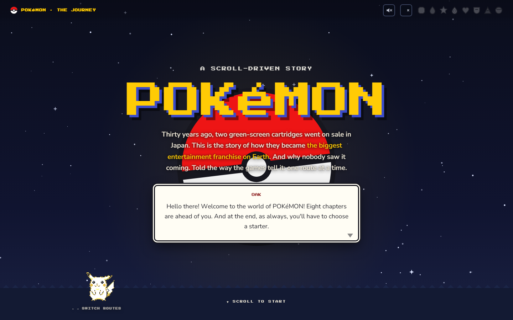

# POKéMON — The Journey

Thirty years of Pokémon, told one route at a time. From a bug collector's dream in 1980s Tokyo to 1,025 species and $130 billion. Choose your starter at the end.



## Play it

**https://kanishka-namdeo.github.io/the-pokemon-journey/**

If that link is a 404, GitHub Pages isn't enabled yet. Open the repo's **Settings → Pages**, set Source to **Deploy from a branch**, pick `main` and `/ (root)`, and save.

### Run locally

The site is fully static, but browsers block Web Audio and `fetch` on `file://` pages, so serve it over HTTP. From the repo root:

```sh
python -m http.server 8000
# or: npx serve
```

Then open <http://localhost:8000>.

## What's inside

Scroll to travel eight routes through thirty years of Pokémon. Chapter music crossfades as each route begins, retro SFX punctuate the story, and every route earns a badge for the case in the top bar. A full case opens your Trainer Card. Arrow keys (← →) warp between routes.

1. **ROUTE 1** · MACHIDA, TOKYO · 1983
2. **ROUTE 2** · THE WORLD · 1996–1999
3. **ROUTE 3** · NINE REGIONS · 1996–2022
4. **ROUTE 4** · 18 TYPES · SUPER EFFECTIVE
5. **ROUTE 5** · EEVEE · 8 DESTINIES
6. **ROUTE 6** · THE REAL WORLD · JULY 6, 2016
7. **INDIGO PLATEAU** · HALL OF FAME · THE RECORD
8. **OAK’S LAB** · PALLET TOWN · YOUR TURN

- A national Pokédex device: browse all 1025 species, search/filter/sort, view stats, evolution, moves, type matchups, hear cries, and mark species seen/caught (data via PokéAPI).

Along the way: a Pokédex moment, the Hall of Fame record still counting, and a finale at Oak’s Lab where three Poké Balls wait on the table. Bulbasaur, Charmander, or Squirtle. You may choose only one.

## Tech

- One `index.html`: markup, styles, and vanilla JS in a single file.
- GSAP (ScrollTrigger, SplitText, ScrambleTextPlugin, Physics2DPlugin, MotionPathPlugin) and Lenis, vendored in `lib/`.
- Web Audio API for the chapter music loops and one-shot SFX.
- Type set in Press Start 2P, VT323, and Nunito from Google Fonts.
- No build step, no dependencies to install.

## Repository layout

| Path | Contents |
| --- | --- |
| `index.html` | The whole experience |
| `lib/` | Vendored GSAP + Lenis |
| `sprites/` | PokéAPI artwork in `art/`, `pix/`, `pix-y/`, `items/`, stored locally with remote fallback |
| `audio/` | `music/`, `sfx/`, and `ATTRIBUTION.md` |
| `assets/` | Social preview image |

## Credits & licenses

- Code: [MIT](LICENSE).
- Audio: CC0 1.0 by Juhani Junkala, detailed in [audio/ATTRIBUTION.md](audio/ATTRIBUTION.md):
  - Sound effects: https://opengameart.org/content/512-sound-effects-8-bit-style
  - Music: https://opengameart.org/content/5-chiptunes-action
  - Theme song: https://opengameart.org/content/theme-song-8-bit
- Sprites and artwork via [PokéAPI](https://pokeapi.co).
- Fonts from [Google Fonts](https://fonts.google.com), under the SIL Open Font License.

This is a fan-made tribute, built for the love of the game. POKéMON and all character names are trademarks of Nintendo, Creatures Inc. and GAME FREAK inc.
